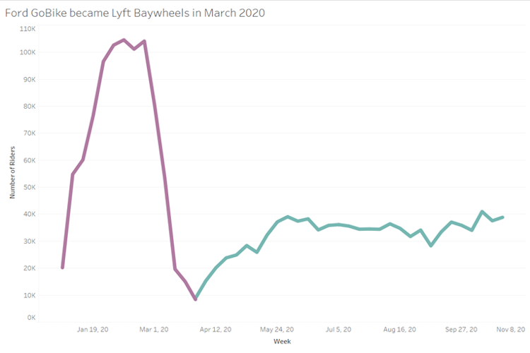
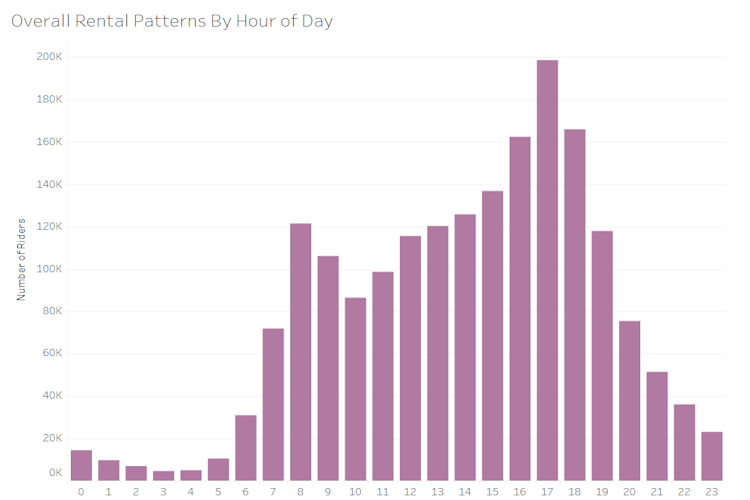
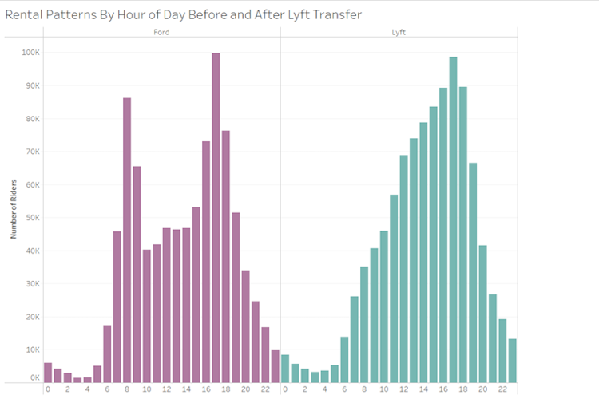
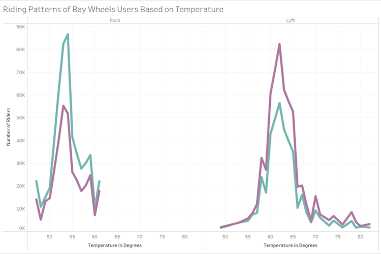

# **Lyft Baywheels: Bikeshare User Analysis**

**Table of Contents**

-   [Introduction](#introduction)
-   [Task 1: Top User Engagement](#top-user-engagement)
-   [Task 2: Preparing the Data and Creating New
    Features](#preparing-the-data-and-creating-new-features)
-   [Task 3: Visualizing and Analyzing Using
    Tableau](#visualizing-and-analyzing-using-tableau)
-   [Task 4: Communicating Results](#communicating-results)

# Introduction

The purpose of this project is to examine the performance of Lyft's bicycle rental company, Lyft Baywheels, in the city of San Francisco. The rental company was originally Ford GoBike and Lyft bought the company from Ford in March 2020 at the height of the global pandemic. Lyft is now interested to see how they can grow their user base in San Francisco as the lockdown is coming to an end.

The lyft.baywheels dataset reports information about rentals made on the Bay Wheels bike share system. Each row represents a single rental:

- **started_at** - Timestamp for start of rental
- **started_date** – Date for start of rental
- **ended_at** - Timestamp for end of rental
- **start_station_name** - For rentals that started from a bike dock, the name of the dock.
- **end_station_name** - For rentals that ended at a bike dock, the name of the dock.
- **start_lat, start_lng** - Latitude and longitude, respectively, of the start of the rental.
- **end_lat, end_lng** - Latitude and longitude, respectively, of the end of the rental.
- **member_casual** - String indicating whether the rental was made by a system “member”, who has a monthly subscription with the bikeshare system, or by a “casual” user, who is making a one-time rental.

The ford.gobike dataset has information very similar to the lyft.baywheels table, but reports rides prior to Lyft’s takeover of the bikeshare system. One major distinction between the two tables is different field names.


| Lyft Baywheels        | Ford GoBike                 | 
| :----------------     | :----------                 | 
| started_at            |   start_time                | 
| ended_at              |   end_time                  | 
| start_station_name    |  start_station_name         | 
| end_station_name      |  end_station_name           | 
| start_lat             |   start_station_latitude    | 
| start_lng             |   start_station_longitude   | 
| end_lat               |  end_station_latitude       | 
| end_lng               |  end_station_longitude      |
| member_casual         |  user_type                  |


The sf.weather dataset contains daily weather statistics recorded at SF International Airport through 2020:

-	**date** - Date of weather recordings
-	**temperature_avg** - Average temperature in Fahrenheit
-	**precipitation** - Recorded precipitation in inches
  
------------------------------------------------------------------------

# Top User Engagement

- Write a query that filters the ford.gobike data to only include data from the year 2020
``` SQL
SELECT
  *
FROM
  ford.gobike
WHERE
  date_part('year', start_time) = '2020'
```

- Write a query that unions the ford.gobike dataset and the lyft.baywheels dataset using the corresponding columns above
``` SQL
SELECT
  started_at,
  ended_at,
  start_station_name,
  end_station_name,
  start_lat,
  start_lng,
  end_lat,
  end_lng,
  member_casual
FROM
  lyft.baywheels
UNION
SELECT
  start_time,
  end_time,
  start_station_name,
  end_station_name,
  start_station_latitude,
  start_station_longitude,
  end_station_latitude,
  end_station_longitude,
  user_type
FROM
  ford.gobike
WHERE
  date_part('year', start_time) = '2020'
```

- Create a new column called data_source that has the value ‘Lyft’ if the data came from the Lyft dataset and the value ‘Ford’ if it came from the Ford dataset.
``` SQL
SELECT
  started_at,
  ended_at,
  start_station_name,
  end_station_name,
  start_lat,
  start_lng,
  end_lat,
  end_lng,
  member_casual,
  'Lyft' AS data_source
FROM
  lyft.baywheels
UNION
SELECT
  start_time,
  end_time,
  start_station_name,
  end_station_name,
  start_station_latitude,
  start_station_longitude,
  end_station_latitude,
  end_station_longitude,
  user_type,
  'Ford' AS data_source
FROM
  ford.gobike
WHERE
  date_part('year', start_time) = '2020'
```
------------------------------------------------------------------------

# Preparing the Data and Creating New Features

- The member_casual column is supposed to indicate whether the rental was made by a system “member”, who has a monthly subscription, or by a “casual” user, who is making a one-time rental. The member_casual column actually has four different values: ‘member’, ‘Subscriber’, ‘casual’, and ‘Customer’. This is because Ford referred to its members as ‘Subscribers’ and its casual users as ‘Customer’ in its data. Write a query that returns all the variables from project.ford_lyft_analysis, plus a new variable called “member_type”, that contains only values that match the Lyft classifications: ‘member’ or ‘casual’.
``` SQL
SELECT
  *,
  CASE
    WHEN member_casual = 'Customer' THEN 'casual'
    WHEN member_casual = 'Subscriber' THEN 'member'
    ELSE member_casual
  END AS member_type
FROM
  project.ford_lyft_analysis
```
- Let’s investigate if patterns are driven by changes in weather. San Francisco's average daily temperature and amount of precipitation are the best metrics to base your weather analysis on. These are located in the temperature_avg and precipitation columns, respectively, of the sf.weather table. Modify your query from part B once more to join the table with the sf_weather data on the started_date field. From the sf_weather table, return the weather date, the average daily temperature, and the amount of precipitation.
``` SQL
SELECT
  date,
  temperature_avg,
  precipitation,
  f*,
  CASE
    WHEN member_casual = 'Customer' THEN 'casual'
    WHEN member_casual = 'Subscriber' THEN 'member'
    ELSE member_casual
  END AS member_type
FROM
  project.ford_lyft_analysis AS f
  INNER JOIN sf.weather ON sf.weather.date = f.started_date
```
------------------------------------------------------------------------

# Visualizing and Analyzing Using Tableau

</br>

[Click Here to View the Deliverable on Tableau Public](https://public.tableau.com/views/LexiPughLyftBaywheelsProject/Task3D?:language=en-US&:display_count=n&:origin=viz_share_link)

</br>

- Start your exploration by plotting the number of rentals made each week. Using your visualization, when did operations transfer over from Ford to Lyft? Are there any major differences in the volume of rentals before and after the transfer?



The transfer from Ford to Lyft happened in late March 2020. There have been a lot less rentals since the transfer took place, but that doesn’t seem to be the fault of the transfer considering the fact that rental rates were already going down early in March 2020 before the transfer took place. Based on the timing of the steep decline, I would say that the decrease in rentals is likely due to the shut down the Covid-19 pandemic caused.

</br>
</br>

- Create a bar chart to depict the total number of rides during each hour of the day. During which hours of the day are customers most likely to rent a bike?



Customers are most likely to rent a bike between 8am and 10am and between 4pm and 6pm.

</br>
</br>

- Modify your visualization to create two side-by-side bar charts: one to illustrate the total number rides during each hour of the data for Ford GoBike data, and the other for Lyft Baywheels. Regarding popular hours of the day, what differences do you notice between Lyft users and Ford users? 



As mentioned previously, when the company was Ford GoBike the most common rental times were between 8am and 10am and between 4pm and 6pm. These times likely mean that many people were renting bikes for their commute to work. On the other hand, when the company became Lyft Baywheels renting in the evening became a lot more common. This is likely because many people were working from home and no longer had a commute to and from work. The data shown likely represents people renting the bikes for other activities like exercising or maybe people just trying to get out of their houses during the shutdown.

</br>
</br>

- Create a line plot of the average temperature on the horizontal-axis and the number of rides taken on the vertical-axis. Plot one line for each Member Type. Compare Ford ridership with Lyft ridership. How does the temperature affect ridership? Which riders are more willing to use a bike on cold days, and which riders are more likely to ride on warmer days?



Back when the rental was heavily used for work commutes, member users would take out a rental even when it was cold out, a lot more than casual users. They likely just sucked it up since they had to get to work even if it was cold outside. Now that the pandemic has changed the way the bikes are used, it seems like members and casual users prefer for the weather to be nicer before they rent one out.

</br>

------------------------------------------------------------------------

# Communicating Results

- In a single paragraph, summarize what can be gleaned from your visualizations. In particular, are there differences between the datasets representing Ford and Lyft riders? How might Lyft market to customers in order to build upon the success of Ford’s GoBike program?

The way that users used Ford GoBike differs a lot from how users use Lyft Baywheels due to the effect of the Covid-19 pandemic. Ford GoBike had their peak rental hours from 8am-10am during the morning work commute and from 4pm to 6pm in the evening work commute. Lyft Baywheels has more rentals happening in the afternoon and evening with their peak being in the evening from 4pm to 6pm. While users may not be commuting to work at the time of this dataset, I would still recommend that Lyft specifically market towards commuters to build up their customer base. I would recommend this because the pandemic will end eventually and as places start opening back up, people will start commuting again. We could offer some  incentives to commuters to use Lyft Baywheels rather than other competitors in preparation for when that time comes.
